<!-- GENERATED by scripts/build-cookbook.ts — do not edit by hand. -->
<!-- To change copy/order, edit examples/manifest.ts and regenerate. -->

# Cookbook

Every example in the gallery, organized by task — texample-style.
Each card links its tested source in `examples/`; the thumbnails are
rendered by that exact code (regenerate with `npm run docs:cookbook`).

## Geometry & math

Constructions, theorems, conics, plots, and fractals — the texample.net/science heartland.

### Bare geometry — draw / filldraw

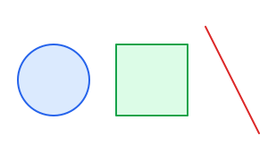

TikZ-style path verbs on raw geometry. `filldraw` strokes and fills; `draw` strokes only. No renderer methods in sight — the picture is its own compile target.

**Source:** [`examples/geometry.ts`](../../examples/geometry.ts)

### Points & TikZ operators

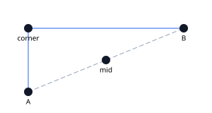

`toward` is TikZ's (A)!t!(B) interpolation; `horAt`/`verAt` are the |- and -| orthogonal-completion operators.

**Source:** [`examples/points-tikz.ts`](../../examples/points-tikz.ts)

### Intersections

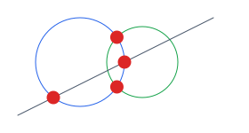

Exact line-circle and circle-circle intersections, marked on the drawing.

**Source:** [`examples/intersections.ts`](../../examples/intersections.ts)

### Triangle centers & circumcircle

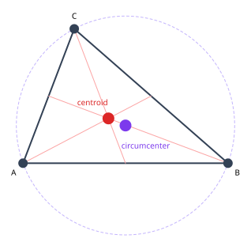

Centroid, circumcenter, and the circumscribed circle through all three vertices.

**Source:** [`examples/triangle-centers.ts`](../../examples/triangle-centers.ts)

### Conic sections

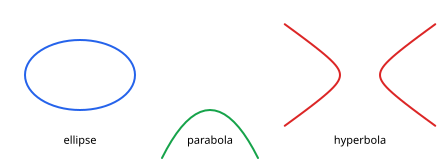

Ellipse, parabola, and hyperbola as first-class geometry.

**Source:** [`examples/conics.ts`](../../examples/conics.ts)

### Function plotting — cartesian & polar

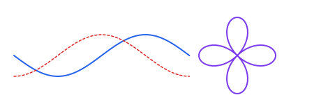

Built-in plotting: sampled cartesian functions and polar curves.

**Source:** [`examples/plotting.ts`](../../examples/plotting.ts)

### Pythagorean theorem

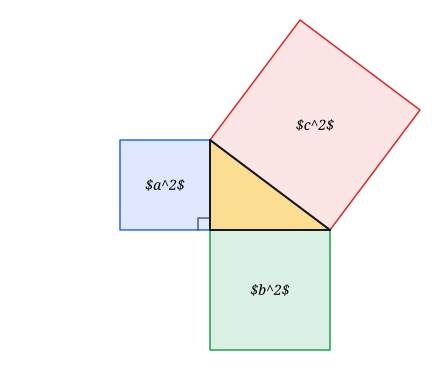

The texample classic: a 3-4-5 right triangle with outward squares computed from the side vectors — no hand-placed coordinates — and KaTeX area labels at each square's centroid. The right-angle marker is one pen corner statement (TikZ |-).

**Source:** [`examples/pythagoras.ts`](../../examples/pythagoras.ts)

### Riemann sum

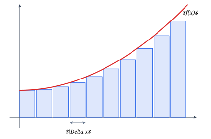

Left-rule bars under a plotted curve. plot() maps y without flipping (screen coords), so the function is negated — the bars and the curve share one scale/offset pair. fill-opacity keeps the overlap readable.

**Source:** [`examples/riemann.ts`](../../examples/riemann.ts)

### Venn diagram

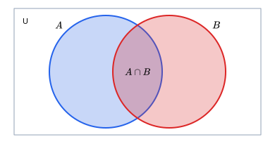

Two set circles as nodes with translucent fills — their labels are node labels anchored north west / north east, so they track the circles. $A \cap B$ sits at the centers' midpoint.

**Source:** [`examples/venn.ts`](../../examples/venn.ts)

### Angle marking (angles & quotes)

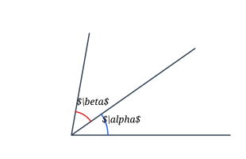

The TikZ angles library idiom: rays from one vertex via polar() — one pen statement with mid-path moves, \draw (O) -- (A) (O) -- (B) (O) -- (C) — and each angle arc a pen statement whose KaTeX label rides the arc itself via pos/offset (TikZ's node[midway]) — everything derived from the ray angles, no hand-placed label points.

**Source:** [`examples/angle-marking.ts`](../../examples/angle-marking.ts)

### Unit circle — porting a TikZ slide (derivative of sine)

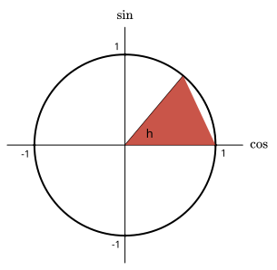

A line-for-line port of a Beamer TikZ slide: polar() for (θ:r) coordinates, arc() for the angle marker, a fluent pen statement for the wedge (fill mode), labels hung on the draw verbs themselves — { label: { at: 'east' } } is the node[right] inside a \draw statement; KaTeX labels included. A canvas Transform.translation centers the origin (toSVG has no auto-fit). The one convention flip: TikZ angles run counterclockwise with y up, jikz clockwise with y down — so TikZ (θ:r) becomes polar(-θ, r) and arc(0:θ:1) becomes arc(o, r, 0, -θ, true).

**Source:** [`examples/unit-circle-derivative.ts`](../../examples/unit-circle-derivative.ts)

### Perpendicular bisectors → circumcenter

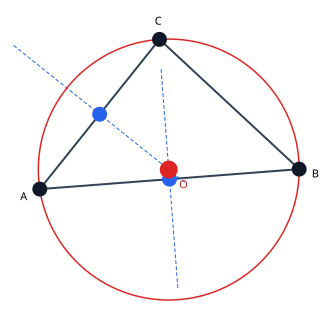

Construct the circumcenter instead of calling it: midpoints, side normals, two dashed bisectors, and intersectLineLine recovers O — which the circumscribed circle then proves. Vertex labels are pushed outward from the centroid, no hand-picked offsets.

**Source:** [`examples/perp-bisectors.ts`](../../examples/perp-bisectors.ts)

### Earth's orbit — ellipse foci

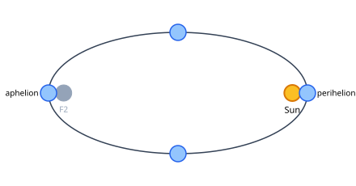

Kepler's first law as geometry: the Sun sits at orbit.foci[1] (not the center!), Earth positions come from ellipse.pointAt(angle), and perihelion/aphelion labels ride outward from the center-to-planet ray.

**Source:** [`examples/earth-orbit.ts`](../../examples/earth-orbit.ts)

### Circle through 3 points

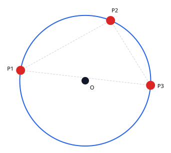

circleThrough recovers the unique circle (null when collinear). Chords show the defining triangle, the center is marked, and point labels are pushed outward along the center-to-point ray.

**Source:** [`examples/circle-through.ts`](../../examples/circle-through.ts)

### Sunflower phyllotaxy

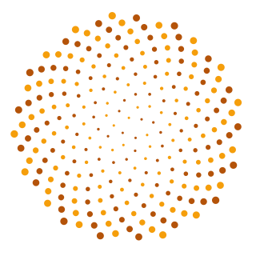

Biology's favorite spiral: 250 florets on a Vogel spiral — radius c·√n, angle n·137.508° (the golden angle). Ten lines of math, and the alternating fills make the Fibonacci arms visible.

**Source:** [`examples/phyllotaxy.ts`](../../examples/phyllotaxy.ts)

### Koch snowflake

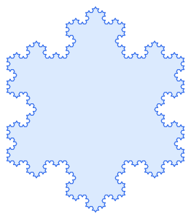

The texample fractal classic, at recursion depth 4. The whole construction is point arithmetic: toward() splits each segment in thirds, polar() at (direction − 60°) places the equilateral bump. One pen statement paints the 768-segment outline as a single filldraw path.

**Source:** [`examples/koch-snowflake.ts`](../../examples/koch-snowflake.ts)

## Physics & engineering

Optics and circuit schematics — ports, typed symbols, and wires instead of coordinates.

### Snell's law — interactive refraction

LIVE: drag the slider to change the incidence angle — the whole card (slider + redraw) is the code below, re-rendering on every input. n1 sin(θ1) = n2 sin(θ2) computed in code; angle arcs and KaTeX \theta labels derive from the actual ray directions via angleTo.

**Source:** [`examples/snell.ts`](../../examples/snell.ts)

### Circuit symbol gallery — ext/circuits

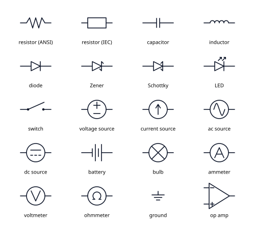

The circuits extension (jikz's \usetikzlibrary{circuits.ee} analogue) ships symbols built ONLY on public seams: registerShape, port anchors, rotate. registerCircuits() registers the names at runtime, while a ShapeRegistry augmentation makes them known to the IDE — shape names autocomplete and misspellings are compile errors. The circuit.* builders used below are the fully-typed route: variants autocomplete too. Every symbol has an intrinsic size and never stretches to fit text.

**Source:** [`examples/circuit-symbols.ts`](../../examples/circuit-symbols.ts)

### Two ways to reference symbols — strings vs typed builders

The SAME circuit built twice. Top: string specs — shape names autocomplete via the ShapeRegistry augmentation, and 'R1.out'-style port strings resolve at runtime (typo'd ports throw AnchorError listing known names). Bottom: typed builders — circuit.resistor(...) returns ordinary NodeOptions with compile-checked variants, and symbol instances expose ports as Points (r1.out), so even port typos are compile errors. Both styles produce the same objects and mix freely; the RC-filter and op-amp cards use the typed style.

**Source:** [`examples/circuit-typed-api.ts`](../../examples/circuit-typed-api.ts)

### RC low-pass filter — ports, rotation, wires

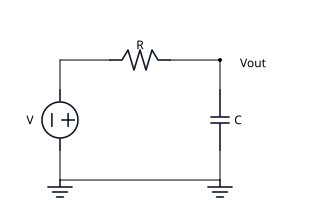

A full schematic composed from ports, not coordinates. Symbols are placed with the typed circuit.* builders (names, rotate, anchor — all compile-checked); voltage source and capacitor rotate 90° for vertical branches; wire() chains endpoints (name.port specs and raw points) with arrows off; junctionDot marks the output node; ground nodes are placed by their 'in' terminal (at + anchor, TikZ's at+anchor=). Every connection is 'R1.out', not a hand-computed point.

**Source:** [`examples/circuit-rc-filter.ts`](../../examples/circuit-rc-filter.ts)

### Inverting amplifier — multi-port op-amp, fully typed

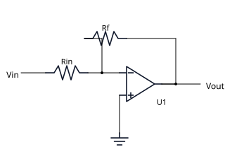

The op-amp is the multi-port validation of the port system — and the fully-typed workflow: symbol INSTANCES (opAmp(), resistor()) expose ports as Points (u1.minus/.plus/.out), so even wire endpoints autocomplete and a typo'd port is a compile error. Each instance doubles as its node's shape ({ shape: u1 }); the string path ('U1.-') still resolves against it at runtime. The feedback loop routes Rf around the top with wire() corners; the + input grounds with a single vertical drop.

**Source:** [`examples/circuit-opamp.ts`](../../examples/circuit-opamp.ts)

## Graphs & networks

Complete graphs, state machines, graphical models — named nodes and boundary-aware edges.

### Named-node graph with anchored edges

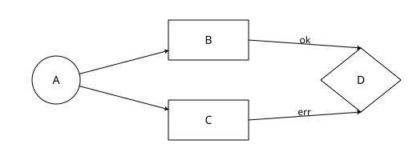

Four nodes plus four edges, referenced entirely by name. `'B.east'` / `'D.north'` pin specific anchors; bare `'A'` / `'B'` auto-resolve to the nearest boundary. No JS variables threaded through the scene.

**Source:** [`examples/named-graph.ts`](../../examples/named-graph.ts)

### Flow diagram

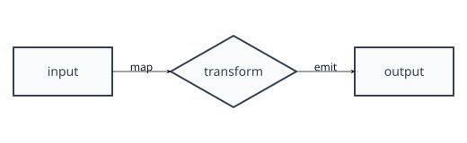

Three nodes and two labeled arrows — and the edge style uses the typed array form: [thick, { stroke }], TikZ's option list as data.

**Source:** [`examples/flow.ts`](../../examples/flow.ts)

### Complete graph K5 — nodeCircle

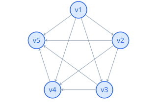

Graph theory: nodeCircle lays the vertices on a ring, then every pair gets an edge referenced by name. Boundary anchoring means the chords clip at the node rims for free.

**Source:** [`examples/complete-graph.ts`](../../examples/complete-graph.ts)

### Probability tree

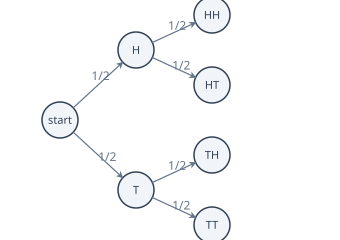

Statistics classic: two coin flips as a right-growing tree. The tree builder computes positions; edges carry the branch probabilities as labels — TikZ's edge from parent node [above] {1/2}.

**Source:** [`examples/probability-tree.ts`](../../examples/probability-tree.ts)

### TCP state machine

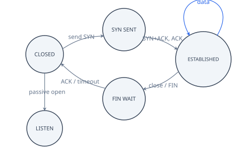

The texample classic: five states, bend edges with transition labels, and a self-loop for data transfer — edge routing (bendAngle, out/in, looseness) doing real diagram work.

**Source:** [`examples/tcp-states.ts`](../../examples/tcp-states.ts)

### Bayesian network — plate diagram

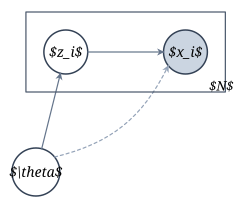

The graphical-model staple: latent and observed variables (the observed one shaded), a dashed dependency, and the repetition plate as a rectFit around the subset with the count in the corner — TikZ's 
ode[fit=(z)(x), label=below right:N]. No hand-computed box coordinates.

**Source:** [`examples/plate-diagram.ts`](../../examples/plate-diagram.ts)

## Statistics & data

Charts and distributions built from raw arrays — data in, diagram out, no chart library between.

### Grouped bar chart

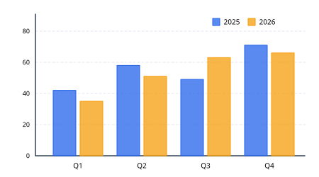

The chart-library staple drawn from raw data: dashed gridlines, axes as one pen statement, bars as a rect loop, legend chips as tiny filldraws. jikz doesn't chart for you — it puts the skeleton exactly where you put it.

**Source:** [`examples/bar-chart.ts`](../../examples/bar-chart.ts)

### Function & derivative with tangent

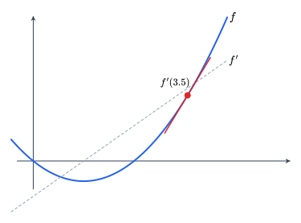

f and f' on shared axes; the tangent at x=3.5 is computed from the derivative — lineFromAngle turns atan(f'(x)) into geometry. The calculus-slide figure, no hand-computed slope.

**Source:** [`examples/derivative-sketch.ts`](../../examples/derivative-sketch.ts)

### Normal curve with shaded tail

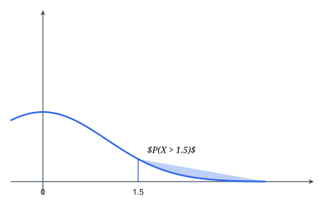

The statistics-textbook figure: P(X > 1.5) as a closed plot on [1.5, 3.5] — sample the density, close the path, and the fill lands between curve and axis with no polygon stitching.

**Source:** [`examples/normal-curve.ts`](../../examples/normal-curve.ts)

### Polar rose gallery

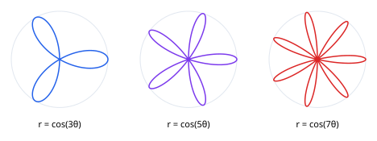

r = cos(k·θ) for k = 3, 5, 7 via plotPolar (degrees, centered) — three curves composed by three centers, each over a dashed unit guide ring.

**Source:** [`examples/polar-roses.ts`](../../examples/polar-roses.ts)

### Lissajous figures

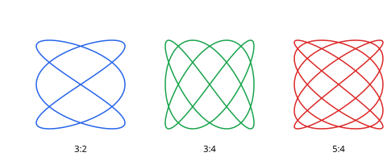

x = sin(a·t + δ), y = sin(b·t) through plotParametric — the 3:2, 3:4, and 5:4 frequency families side by side, one scale/offset pair per figure.

**Source:** [`examples/lissajous.ts`](../../examples/lissajous.ts)

### Box plot from raw data

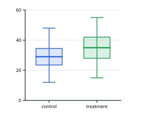

Quartiles computed in code; whiskers as one multi-subpath pen statement, boxes as filldraw pens, medians as thick lines. The point is the pipeline — data in, diagram out, no chart library between.

**Source:** [`examples/box-plot.ts`](../../examples/box-plot.ts)

## Computer science & automata

State machines, trees, nets, and branch graphs — the diagrams CS textbooks run on.

### DFA acceptor

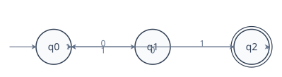

The automata-textbook DFA for strings ending in "01": double-circle acceptor (node + concentric ring), symbol-labeled bend transitions, self-loops, and a start arrow from a bare point — all three endpoint kinds in one card.

**Source:** [`examples/dfa-acceptor.ts`](../../examples/dfa-acceptor.ts)

### Binary search tree with search path

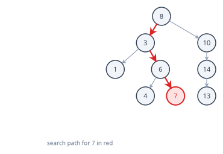

A real BST built by insertion in code, laid out by the tree builder; the search path for key 7 is highlighted by name-addressed edges — layout and styling as separate passes.

**Source:** [`examples/binary-search-tree.ts`](../../examples/binary-search-tree.ts)

### Petri net with marking

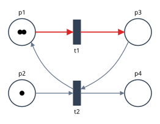

Places, transitions (bars), and token dots: a marked net where t1 is enabled, its in/out edges highlighted. The networking-theory classic as pure node+edge work.

**Source:** [`examples/petri-net.ts`](../../examples/petri-net.ts)

### Neural network diagram

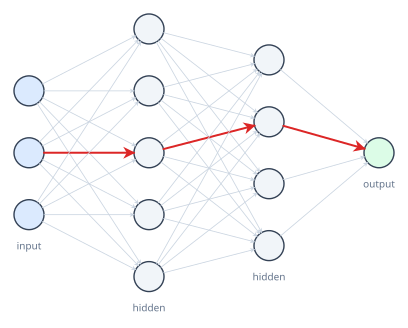

The ML-slide staple: layered nodes from arrays, 24 dense inter-layer edges clipped at node rims for free, and one highlighted forward-pass path picked out by name.

**Source:** [`examples/neural-network.ts`](../../examples/neural-network.ts)

### Git branch graph

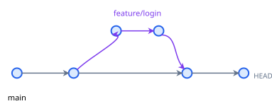

main + feature branch with a merge: commit dots are Anchorable circles, fork and merge edges use out/in headings so the branch joins like railway tracks.

**Source:** [`examples/git-branch-graph.ts`](../../examples/git-branch-graph.ts)

## Diagram layout

Chains, matrices, trees, and fit-boxes: declare structure, get coordinates.

### Chain layout

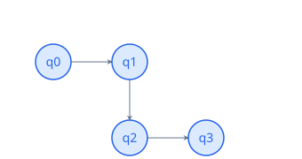

Chains position successive nodes and wire the edges for you.

**Source:** [`examples/layout-chain.ts`](../../examples/layout-chain.ts)

### Matrix layout

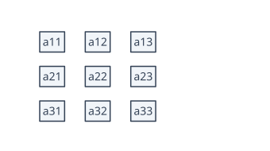

A TikZ matrix of nodes: rows of cells with column/row separation and automatic alignment.

**Source:** [`examples/layout-matrix.ts`](../../examples/layout-matrix.ts)

### Tree layout

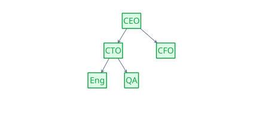

Hierarchical auto-layout: declare the tree, jikz positions every level.

**Source:** [`examples/layout-tree.ts`](../../examples/layout-tree.ts)

### rectFit — TikZ fit library

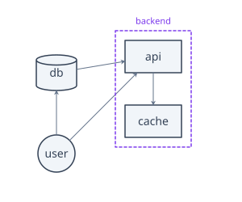

TikZ's \node[fit=(api)(cache)] : rectFit computes the tight rectangle around a subset of nodes' bounds; add padding, draw it dashed, and the backend grouping draws itself.

**Source:** [`examples/fit-library.ts`](../../examples/fit-library.ts)

## Nodes & edges

Feature tours of the node/anchor/label and edge-routing systems.

### Auto-sized node

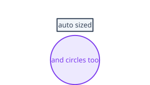

No width/height given — the node measures its own text (canvas in the browser) and sizes the shape to fit.

**Source:** [`examples/node-auto-size.ts`](../../examples/node-auto-size.ts)

### Compass & angle anchors

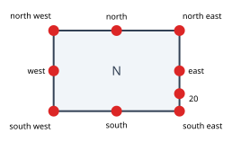

Every shape exposes named anchors (north … south west), aliases ('ne'), and numeric angles. Screen convention: 0° east, 270° = north.

**Source:** [`examples/anchors.ts`](../../examples/anchors.ts)

### Node labels (TikZ label=)

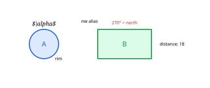

`labels` on a node are TikZ's `label=<angle>:<text>`: placed on the boundary (outer sep included), pushed out by `distance` — a border-to-border gap, so font size is accounted for. Accepts named anchors, aliases, and numeric angles (screen convention: 270° = north). `$...$` goes through KaTeX.

**Source:** [`examples/node-labels.ts`](../../examples/node-labels.ts)

### Named-node edge (boundary-anchored)

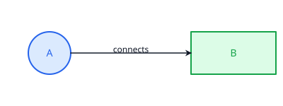

Reference nodes by name in `edge(...)`. A bare name resolves to the boundary point closest to the other endpoint — no manual padding. Swap to `'A.north'` / `'B.west'` to pin a specific anchor.

**Source:** [`examples/node-to-node-edge.ts`](../../examples/node-to-node-edge.ts)

### Shape gallery — all SHAPE_TYPES

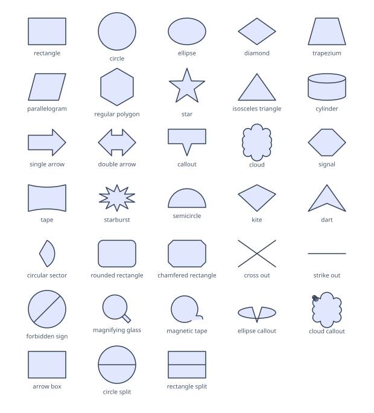

Every shape-type string the library exports, iterated from jikz's own SHAPE_TYPES. Labels are placed from each shape's measured bounds, so pointers and arrow heads can't collide with them.

**Source:** [`examples/shape-gallery.ts`](../../examples/shape-gallery.ts)

### Edge routing — bends, out/in, loops

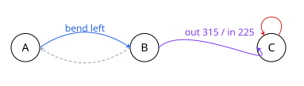

bendAngle curves to the LEFT of travel when positive; out/in give absolute departure and arrival angles; a self-edge with looseness makes a loop.

**Source:** [`examples/edge-routing.ts`](../../examples/edge-routing.ts)

### Arrow tips & TikZ specs

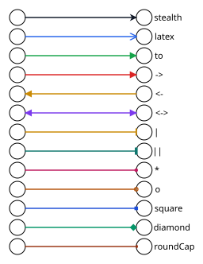

stealth, latex, to, bar — plus the TikZ spellings ->, <-, <->. Arrowheads always take the edge's stroke color.

**Source:** [`examples/arrow-tips.ts`](../../examples/arrow-tips.ts)

## Paths, decorations & styles

Feature tours of pen statements, path surgery, decorations, and the style vocabulary.

### Path builder + filldraw

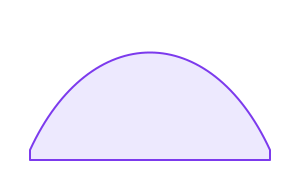

Chainable path construction — moveTo / lineTo / curveTo / close — then handed to `.filldraw()` so both stroke and fill apply in one verb.

**Source:** [`examples/path-builder.ts`](../../examples/path-builder.ts)

### Fluent path statements — pen()

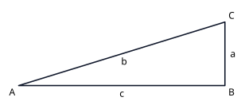

TikZ threads an implicit pen through \draw (a) -- (b) node[right]{x} -- cycle: pic.pen() is exactly that. Segments compile to ONE path; .label(text, { at }) hangs a label on the current pen position without moving it, and { pos } rides the segment just drawn (TikZ node[midway]). Expansion is lazy, so the pen can be built across statements and still paints in registration order.

**Source:** [`examples/pen-statements.ts`](../../examples/pen-statements.ts)

### pen() — named coordinates & mid-statement restyling

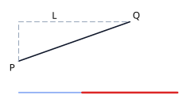

coordinate('P') names the pen position mid-statement (TikZ coordinate (P)); later statements reference names as endpoints — pen.moveTo('P').vhTo('Q') is \draw (P) |- (Q). push(options) restyles mid-statement: subsequent segments compile to a NEW path whose options inherit and override the current run's, so one statement can mix dashed and solid legs.

**Source:** [`examples/pen-coordinates-restyle.ts`](../../examples/pen-coordinates-restyle.ts)

### Path decorations

TikZ decorations: transform any base path into snakes, zigzags, and coils.

**Source:** [`examples/path-decorations.ts`](../../examples/path-decorations.ts)

### Dash patterns

TikZ dash vocabulary: dashed, dotted, dashdotted, and the densely/loosely variants. Each style name is a node label on an invisible zero-size anchor node at the line's end — TikZ's `\draw[dashed] ... node[right] {dashed}` — not absolute text coordinates.

**Source:** [`examples/dash-patterns.ts`](../../examples/dash-patterns.ts)

### Braces & brackets

Annotation paths: curly braces and square brackets between two points.

**Source:** [`examples/braces.ts`](../../examples/braces.ts)

### Fill patterns

The 12 TikZ patterns — hatching, grids, dots, bricks, checkerboard, stars.

**Source:** [`examples/fill-patterns.ts`](../../examples/fill-patterns.ts)

### Gradient, dash, shadow

User-supplied `style` overrides the path-mode baseline. Linear gradients, dashed strokes, and drop shadows all flow through the builder's string pipeline — no DOM dependency.

**Source:** [`examples/styling.ts`](../../examples/styling.ts)

### Double lines & layers

Double-stroked paths (TikZ `double`) and z-order control via named layers.

**Source:** [`examples/double-layers.ts`](../../examples/double-layers.ts)

### KaTeX math labels

Any $...$ text renders through KaTeX (loaded from CDN on this page) inside a foreignObject — works in Node too. Without KaTeX it falls back to plain italic text.

**Source:** [`examples/katex-math.ts`](../../examples/katex-math.ts)

### Path operations — offset / double / smooth / sub

Path surgery: offsetPath parallels a curve on either side, doublePath renders TikZ's double line as two real paths, smoothPath turns a polyline into a spline, subPath highlights the middle 30–70% of it.

**Source:** [`examples/path-operations.ts`](../../examples/path-operations.ts)

## Application prototypes

Real app sketches (chess study tools) — diagrams derived from data, not coordinates.

### Chess prototype — transposition DAG

Repertoire move trees are really DAGs: 1.d4 d5 2.c4 e6 3.Nf3 Nf6 and 1.d4 Nf6 2.c4 e6 3.Nf3 d5 arrive at the SAME Queen's Gambit Declined position. Nodes are plain circle() Anchorables (edges auto-resolve boundary points along the ray), the shared position gets the amber dashed 'transposition' style, and the merge edges use out/in headings so the two histories join like railway tracks.

**Source:** [`examples/chess-transposition-dag.ts`](../../examples/chess-transposition-dag.ts)

### Chess prototype — pawn-structure skeleton

The textbook pawn-skeleton diagram (French Advance structure), auto-derived from square coordinates: the board grid is ONE multi-subpath pen statement, chains are thick translucent pen runs painted under the pawns, levers (\u2026c5, \u2026f6) are dashed stealth-arrow edges with TikZ edge labels, and the chain base is annotated with directional text. In the app, sq() maps FEN squares to points — the diagram derives itself from any position.

**Source:** [`examples/chess-pawn-skeleton.ts`](../../examples/chess-pawn-skeleton.ts)

### Chess prototype — tactics theme radar

Puzzle success rate by motif as a polar spider chart — the diagram charting libraries do badly and jikz does natively: rings and axes derive from polar(), both series are closed filldraw pen statements, and axis labels sit on compass placement. Overlaying the previous period (grey) shows training progress per theme at a glance.

**Source:** [`examples/chess-theme-radar.ts`](../../examples/chess-theme-radar.ts)
